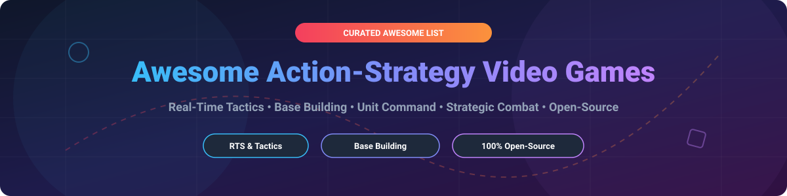

# ⚔️ Awesome Action-Strategy Video Games 🎮

   

**A curated list of commercial action-strategy games, hybrid real-time tactics (RTT), base-building titles, unit command simulators, and open-source strategy game engines.** 🚀

Whether you are looking for real-time strategy (RTS) games, tower defense hybrids, medieval battlefield simulators, or production-grade open-source game projects to play, mod, or inspect, this list covers the top commercial and open-source games in the action-strategy genre.

---

## 📚 Table of Contents
- [📊 Market & Sector Overview](#-market--sector-overview)
- [💼 Commercial Action-Strategy Games](#-commercial-action-strategy-games)
- [🔓 Open-Source Projects & Engines](#-open-source-projects--engines)
- [🤝 How to Contribute](#-how-to-contribute)
- [☕ Support & Community](#-support--community)
- [📈 Star History](#-star-history)
- [⚠️ Disclaimer](#%EF%B8%8F-disclaimer)

---

## 📊 Market & Sector Overview

The global Action-Strategy & Real-Time Strategy (RTS) video game sector represents an estimated market size of **$11.5 Billion USD** (2026), driven by PC gaming growth, esports, and cross-genre hybrids (RTS + RPG, Tower Defense + Factory Automation). The sector is **moderately fragmented**, featuring dominant powerhouse publishers (Microsoft/Xbox Game Studios, Nintendo, Embracer Group/THQ Nordic) alongside established independent studios (TaleWorlds Entertainment, Coffee Stain/Ghost Ship) and a vibrant open-source ecosystem.

---

## 💼 Commercial Action-Strategy Games

Below is a breakdown of top commercial action-strategy games, including company valuation/revenue metrics, starting pricing tiers, and trial/free plan limits.

| 🎮 Game Title | 🏢 Publisher / Company | 💰 Company Valuation / Revenue | 🏷️ Starting Pricing Tier | 🎁 Free Tier / Trial Limits | 📌 Key Features & Highlights |
| :--- | :--- | :--- | :--- | :--- | :--- |
| **[Minecraft Legends](https://www.minecraft.net/en-us/about-legends)** | Microsoft (Xbox Game Studios) | **$3.1 Trillion** (Market Cap) | **$39.99** (Standard Edition) | No free tier or trial (Included in Xbox Game Pass $11.99/mo) | Action-RTS spin-off; command mobs against piglin invasions in real-time. *(Support ended Jan 2024)* |
| **[Pikmin 4](https://www.nintendo.com/)** | Nintendo | **$68 Billion** (Market Cap) | **$59.99** (Standard Edition) | Free Demo available on Nintendo eShop (First region playable, progress carries over) | Real-time unit command & puzzle adventure; manage Pikmin squads and rescued Dandori companions. |
| **[Halo Wars 2](https://www.halowaypoint.com/)** | Microsoft / 343 Industries | **$3.1 Trillion** (Market Cap) | **$39.99** (Standard Edition) | 7-Day Free Trial via Xbox Game Pass Ultimate | Console-optimized real-time strategy in the Halo universe; faction abilities and squad command. |
| **[SpellForce 3](https://www.spellforce.com/)** | Embracer Group (THQ Nordic) | **$2.4 Billion** (Market Cap) | **$39.99** (Reforced Edition) | Free Versus Edition available (Play PvP skirmishes with 1 random faction for free) | RPG-RTS hybrid featuring hero levelling, base building, sector expansion, and tactical army combat. |
| **[Mount & Blade II: Bannerlord](https://www.taleworlds.com/)** | TaleWorlds Entertainment | **$120 Million** (Annual Revenue) | **$49.99** (Standard Edition) | No free tier; periodic 48-Hour Free Steam Trial Weekends | Medieval action-RTS hybrid; fight in third-person while issuing directional squad commands in sieges. |
| **[Overlord II](https://www.codemasters.com/)** | Electronic Arts (Codemasters) | **$36 Billion** (Market Cap) | **$9.99** (Standard Edition) | No free tier or trial | Action-adventure minion command game; control distinct minion types to defeat enemy armies. |
| **[Brutal Legend](https://www.doublefine.com/)** | Xbox Game Studios (Double Fine) | **$3.1 Trillion** (Market Cap) | **$14.99** (Standard Edition) | No free tier or trial | Heavy metal action-RTS hybrid; combines hack-and-slash hero combat with stage battles and unit commands. |
| **[Kingdom Two Crowns](https://www.kingdomthegame.com/)** | Raw Fury | **$45 Million** (Valuation) | **$19.99** (Standard Edition) | Free Demo on Steam (First island exploration limit) | Micro-strategy side-scroller; recruit loyal subjects, expand kingdom walls, and defend against the Greed. |
| **[Tooth and Tail](https://www.toothandtailgame.com/)** | Pocketwatch Games | **$8 Million** (Valuation) | **$19.99** (Standard Edition) | No free tier or trial | Distilled real-time strategy; fast 5-10 minute matches with single-unit leader command and procedural maps. |
| **[AirMech Strike](https://www.carbongames.com/)** | Carbon Games | **$3 Million** (Valuation) | **$0.00** (Free-to-Play Base Game) | Free-to-Play unlimited base access (Optional $9.99 Prime Pack for cosmetic/xp perks) | Action-RTS with transforming mechs; airlift troops, defend bases, and dogfight in fast-paced matches. |

---

## 🔓 Open-Source Projects & Engines

The action-strategy genre boasts a production-proven open-source community. Below are top open-source strategy games and engines sorted by GitHub Stars_Count ⭐.

| 📦 Repository & Project Name | ⭐ GitHub_Stars | 📜 License | 🎯 Primary Category & Tech Stack | 💡 Key Description |
| :--- | :--- | :--- | :--- | :--- |
| **[Mindustry](https://github.com/Anuken/Mindustry)** |  | GPL-3.0 | Tower Defense / Factory Automation (Java/LibGDX) | Open-source sandbox tower defense & logistics hybrid; build supply lines and command attack drones. |
| **[Godot Engine](https://github.com/godotengine/godot)** |  | MIT | Game Engine (C++) | Multi-platform 2D/3D open-source game engine heavily used for custom RTS and action-strategy development. |
| **[Beyond All Reason](https://github.com/beyond-all-reason/Beyond-All-Reason)** |  | GPL-2.0 | Large-Scale RTS (TypeScript/Lua/Recoil) | Massive Total Annihilation-inspired 3D RTS engine featuring physics projectiles and thousands of units. |
| **[Unciv](https://github.com/yairm210/Unciv)** |  | MPL-2.0 | Turn-Based 4X Strategy (Kotlin/LibGDX) | Open-source recreation of Civilization V optimized for desktop and mobile devices. |
| **[The Battle for Wesnoth](https://github.com/wesnoth/wesnoth)** |  | GPL-2.0 | Turn-Based Tactical Strategy (C++) | Long-running open-source tactical strategy game with hex grids, high-fantasy campaigns, and modding. |
| **[Warzone 2100](https://github.com/Warzone2100/warzone2100)** |  | GPL-2.0 | 3D RTS & Unit Design (C++) | 3D real-time tactics game featuring full unit chassis/weapon customization and extensive tech trees. |
| **[Widelands](https://github.com/widelands/widelands)** |  | GPL-2.0 | Economic Strategy / Settlers Clone (C++) | Real-time economic strategy game inspired by Settlers II with deep production chains and multiplayer. |
| **[0 A.D.](https://github.com/0ad/0ad)** |  | GPL-2.0 | Historical Real-Time Strategy (C++/JS) | 3D historical RTS engine covering ancient civilizations with economic expansion and massive warfare. |
| **[OpenRA](https://github.com/OpenRA/OpenRA)** |  | GPL-3.0 | Classic RTS Engine (C#/.NET) | Modern game engine supporting Command & Conquer: Red Alert, Tiberian Dawn, and Dune 2000 mods. |
| **[Spring Engine](https://github.com/spring/spring)** |  | GPL-2.0 | 3D RTS Game Engine (C++) | Powerful 3D RTS engine simulating complex physics, terrain deformation, and large unit counts. |
| **[OpenTTD](https://github.com/OpenTTD/OpenTTD)** |  | GPL-2.0 | Management & Logistics Strategy (C++) | Open-source urban simulation & transport logistics strategy game based on Transport Tycoon Deluxe. |

---

## 🤝 How to Contribute

Contributions to **Awesome Action-Strategy Video Game** are always welcome! 

1. **Fork** this repository. 🍴
2. Create a new branch for your feature or game entry (`git checkout -b feature/new-game-entry`).
3. Add the details into `README.md` following the formatted tables above. 📝
4. **Commit** your changes (`git commit -m 'Add New Action-Strategy Game'`). 
5. **Push** to the branch (`git push origin feature/new-game-entry`).
6. Open a **Pull Request** and describe the addition. 🚀

Check out our full awesome collection at [Awesome-Awesome-Awesome](https://github.com/ishandutta2007/Awesome-Awesome-Awesome).

---

## ☕ Support & Community

If you find this repository helpful for finding new games, building strategy titles, or discovering open-source game engines, please consider supporting the project! ⭐

- **Star this repository** to help others discover it! 🌟
- **Share** it with fellow strategy gamers, developers, and modders. 📢
- **Buy me a coffee**: If you'd like to support open-source curation, consider sponsoring via [GitHub Sponsors](https://github.com/sponsors/ishandutta2007). ☕

Thank you for your support! 💖

---

## 📈 Star History

---

## ⚠️ Disclaimer

- This list is **community-curated** for educational, analytical, and archival purposes.
- Trademarks, game titles, and brand names belong to their respective corporate owners and publishers.
- Open-source project metrics and Stars_Counts are subject to change over time.

---

Made with ❤️ for strategy gamers, RTS developers, modders, and open-source enthusiasts worldwide.

